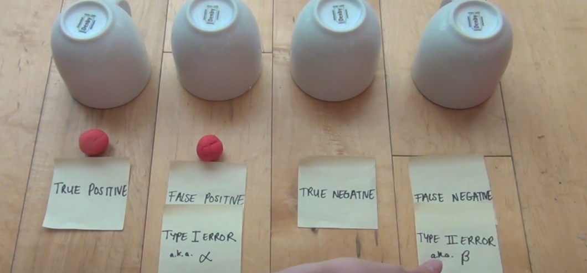
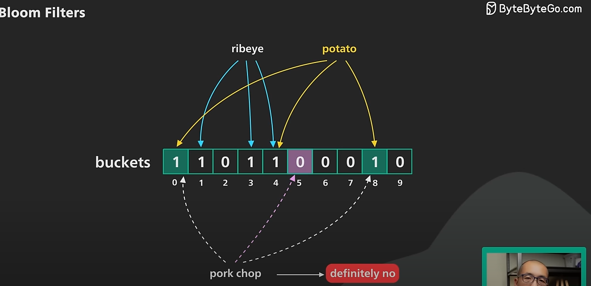
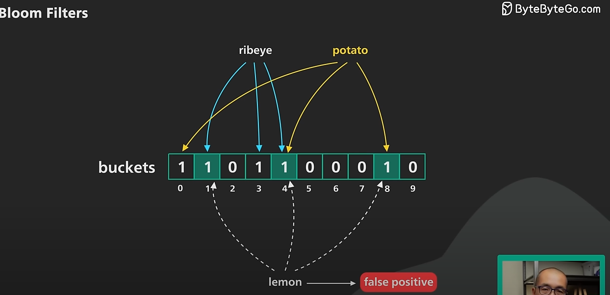

Bloom filters 

-> can report false positives, but can never report false negative. 

User likes ribeye and potato and doesn't like pork chop.
This case gives us correct result.

User doesn't like lemon but the bloom filter denotes it likes lemon.

But the case can never happen where user likes something and it doesn't return the result as negative.

Hence false negatives cannot happen.

That's why for searching in a large data we can use bloom filters.