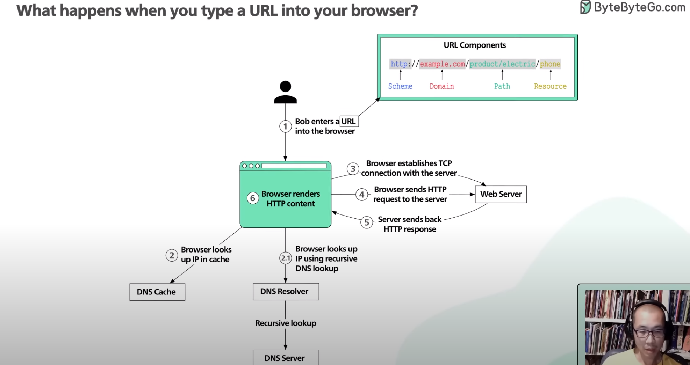
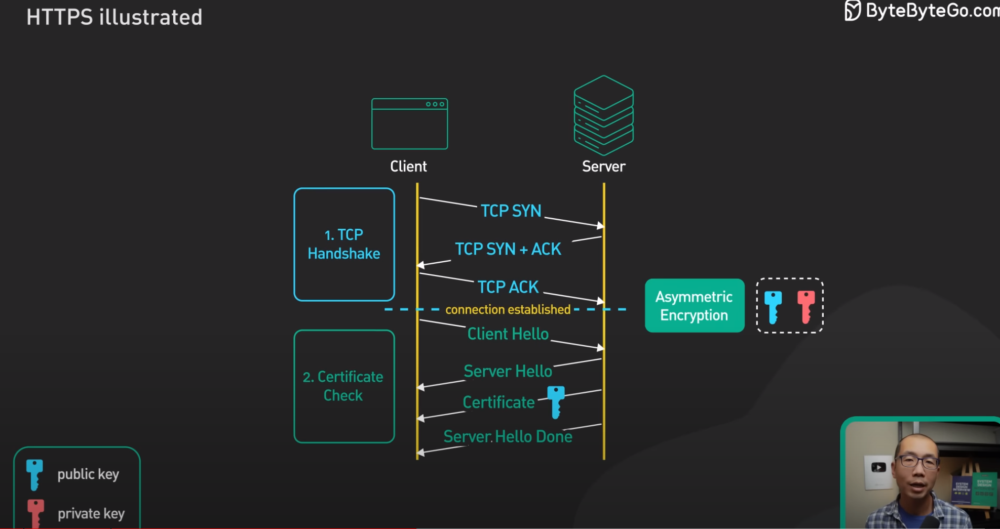

### Http request & response. 

- point 3 is the tcp connection request, which is the 3 way handshake.

### Https Request and reponse.

- the first phase of the establishing the https connection is the same as http. A 3 way handshake between the client and the server.
- The second phase is where, the client sends the supported SSL versions, the encryption that it supports and etc. details. 
- The server then sends one of the client supported encryption suite and SSL versions, in the Server-Hello. 
- Then the server sends the certificate which contains the public key to the client. The client uses this public key to encrypt the data. The data once encrypted by the client using the public key can only be decrypted by the private key.
- This concludes the payload from server to the client.

All dns servers fall into one of 4 categories.
1. recursive resolvers.
2. root nameservers.
3. tld nameservers.
4. authoritative nameservers.

the recursive resolver is between the client and the dns namserver.
recursive resolver - root nameserver -> tld nameserver -> authoritative nameserver.

any point of this loop if the information is cached, the process will return the output circumventing the further processing.

recursive resolver goes to the root nameserver. 
upon seeing the request (.com, .edu, .org), the root nameserver will send the request to the tld nameserver.
the tld nameserver will then checking the main domain name (amazon, google, wikipedia) send the recursive resolver to the authoritative nameserver.

the authoritative nameserver will then send the ip address of the domain name to the recursive resolver.

