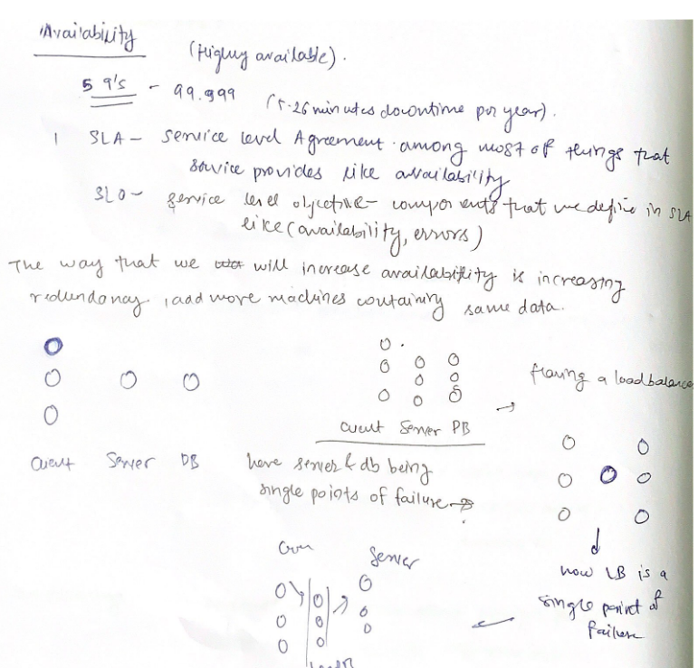
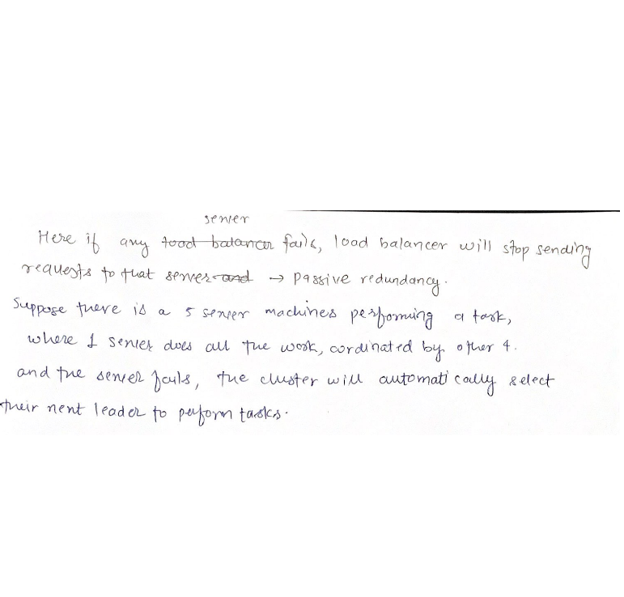
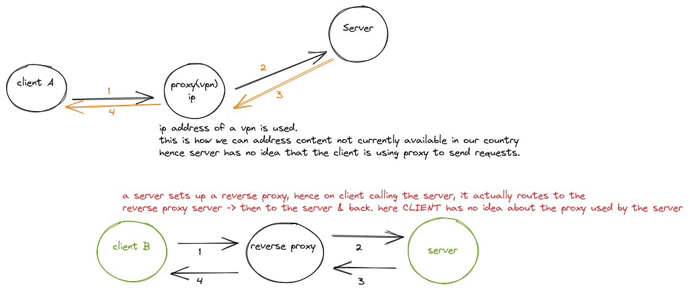

Latency - one whole cycle duration.
        (eg. a request from client to server and back to client).

throughput - the amount of work that the system can do, if the system is said to have a throughput of 1 gbps, it can tranfer igb of data per second.

Availability - Amount of time for which the service/infra was accessible. 

Reliability - is measured from
        a) mean time between failures. 
        b) total maintainence time. 

### ACID (in DBMS)

        Atomicity - transaction with multiple operations, either all or executed or none are.
        this also extends to distributed systems - with operations executed on multiple nodes.

        Consistency - valid to valid state. 
        In distributed systems, this means something different, that all the nodes which serve data have the same image of the data. (in same state).

        Isolation - transactions executed separately or concurrently and have data dependencies, the result is same.

        Durability - committed stays committed. 

### CAP

        2/3 can be provided at a point of time. 
        (Consistency, Availability, Partition Tolerance)
        Consistency - every read request receives result of most recent write request.
        Availability - receives non-error response, without guarantee of reflecting the most recent write. 
        Partition Tolerance - message dropped between networks due to network partition. (THIS IS NOT TO BE ABANDONED.)

        IN THE CASE OF partition tolerance, we can either choose consistency or availability. 

        >> When there is no network partition, there is a trade-off between latency and consistency,
        
        in synchronous replication, to guarantee data consistency, system will have to delay write operations until the data has been propagated across the system taking a latency hit.

        in asynchronous replication, latency will not be a problem but consistency would.

### PACELC THEOREM

        In case of network partition (P), system has to choose between availability(A) and consistency(C) but 
        else (E)
        it has to choose between latency(L) and consistency(C)

### Proxy

using reverse proxy as a load balancer, security, for ratelimiting.