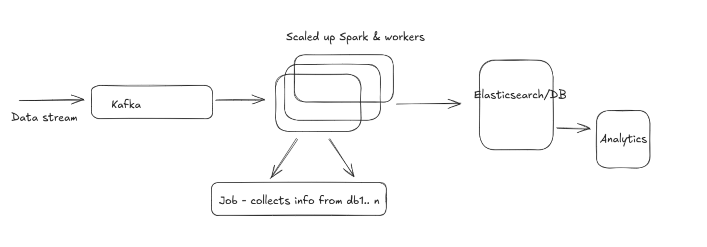

### Big Data Processing
> Why and how ?

> Suppose we have a task to find out which customer has the most orders for today.
> And number of orders are huge, so we can't just keep a track of customers to order and output at the end, this has to be done efficiently.

Single node example:
- Coming a few steps back, if our data is only on a single machine, we can go through the orders and calculate one by one.
- If we use multi threading then this could be done even faster.

But, now as we move to tons of data on hundreds of machine, we cannot use the same algorithm.
- We need to have different jobs to do the calculation for different nodes.
- And we need some manager that assigns jobs to different nodes and collects the results from them. 
- Accounting for failures, retries, scaling etc.
- Hence, Big data processing comes into play.

These frameworks provide us with the managers who co-ordinate all the assignments and calculations and everything.
Ex: Spark, Flunk, Flume etc.

A simple example of the above is as following
