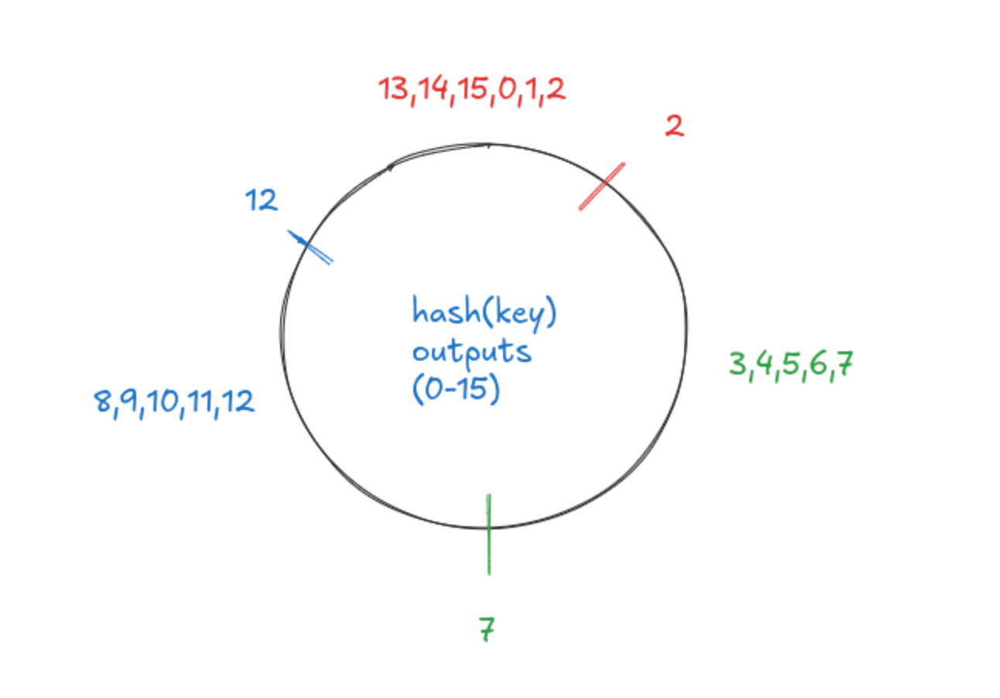

Consistent hashing

Need and Implementation.

> In case of stateless server -> we have no problem where the data is stored as every request is independent of the state of the previous one.

- Insert example: In a stateless system, such as a load balancer handling HTTP requests, the server does not retain any information about the client between requests. Each request is independent and can be processed by any available server.

> In case of a stateful systems (distributed key-value store) we need to keep track of what keys are located in what partition of the data.

- for that we can use hashing, we can hash for a key and decide on what partition should be used to store the key:value.

- this is okay where we don't scale our systems up/down. In case of scaling the following problem will arise:
  - suppose we had 3 machines earlier, a key1, hash(key1) % 3 = 0, so key1 is stored on machine 0.
  - now we have 4 machines and to retrieve data associated with key1, we do hash(key1) % 4 = 1, so we will not be able to retrieve the data.
  - hashing we have to move the data from all the machines to the new machines, which is not feasible, given large amounts of data.

- thus we need something which will reduce this overhead of moving data from one machine to another.

> consistent hashing is the solution to this problem.
- It's better understood with the help of a ring.
- Suppose our hash function returns value between 0-15 (in reality it's 128 or 256).
- we have 3 machines are it's slots are at 2(slot1), 7(slot2) and 12(slot3), so values between 13,14,15,0,1,2 are on machine M1(slot1), and likewise for other machines.
- if we face a high surge of data on machine M1, we can add a new machine M4, and it's slot will be at 0.
- so the data between 13,14,15 & 0 will be moved to M4, and the data between 1,2 will remain at M1. 
  - How is this done ?
  - We take a snapshot of database at machine M1.
  - We iterate through all the keys and recompute their hashes.
  - Any keys which hash to a value between 13,14,15,0 are moved to M4 and they are deleted from M1.