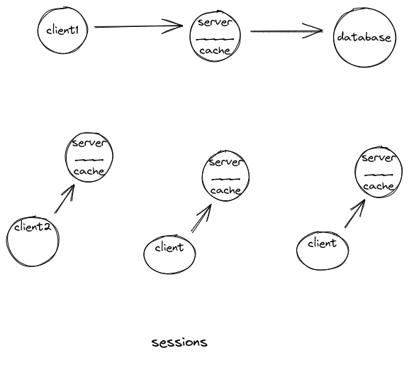

> reducing of network calls. 
> reducing load on db. 

> If there are multiple nodes serving requests, it's possible to have separate caches for each of the machines. if the load balancer randomly distributes requests across the nodes, thus increasing the cache miss. two choices for overcoming this are global cache & distributed caches.

### Types of cache.
- Let's start from the first place that we search for a cache
- Locally - browsers/device - Client side cache - resources (like image, js files, bundles) are saved on the client side once response is received.
- ISPs - proxy server used by ISPs can also cache the response and serve it.
- CDN - cache which is geographically nearer to the client.
  - example: cloudflare, akamai.
  - CDNs can help in short circuiting network calls to the webserver or further processing that has to be done. improving performance, decreasing costs and compute power.
  - 
- Load balancers 
- Web server.

#### Note:
Two things can be done in a cdn 
- proxy
- - you can point to your original site. in which case cdn will act as a proxy
- server
- - you can copy all the files that you need to your cdn in which case in will act as a host

- Whenever a request if received by the client, it contains a Cache-control header.
- It contains values like
  - no-cache - cache is not to be used.
  - max-age - cache is to be used for the time specified.(seconds)
  - public - cache is to be used by any client.
  - private - not to be cached by a cdn.

### Cache fetching/updation techniques.

1. Cache-miss - fetch from db - update cache.
2. Update cache while writing to the db. 
   - example: for a live score app, it makes sense to update the cache during the score update process, along with the database update. as subsequent reads should happen from the cache which should should request on a very large scale and fast.

### Scaling a cache.
- Similar to a normal db.
  - Vertical scaling - increase size of the cache.
  - Horizontal scaling - increase the number of caches, which act as read replicas
  - Sharding - increase the number of caches, which holds mutually exclusive data.

### Cache  invalidation. 
- If data being modified is present as a cache, techniques to keep the data consistent in the cache and the db. 
    1. Write-through cache:
        modified in both places while write time. 
        pros: guarantees consistency, durability if power failure or crash.
        cons: latency

    2. Write-around cache:
        updated only in the backend, create a cache miss & read from slower main server and experience a higher latency.

    3. Write-back cache:
        updated only in the cache and confirmed with the client. 
        writing to a permanent storage is done after a while/under some conditions.

        pros: fast, good for write intensive.
        cons: may cause data loss - crash.  

### Popular Caching policy: 
    least recently used. (LRU)
    least frquently used (no of hits).

problems:

a scenario can happen that the cache being read by client2 is STALE, and just has been updated by client1.

the solution could be the cache can be moved out of each the servers and be a separate entity altogether.

problems:
    each time the user doesn't find the data in the cache, it is an extra call to the cache. 
    Thrashing - the caching policy does not work well as the data is hardly found in the cache. 

So where to place the cache ?

    - on the server side itself, in memory to each server. 
        - PROS: fast, good for a small amount of data.
        - CONS: 
        -   this can be dangerous if the server fails, it can take the cache down as well and as 
            a result, the data in both the servers might not be in sync. 
        -   this can be a problem in many cases as some financial records or so. 

    - can have some as a global cache, where each server queries the global cache. (REDIS)

Resources:
    
    https://lethain.com/introduction-to-architecting-systems-for-scale/
