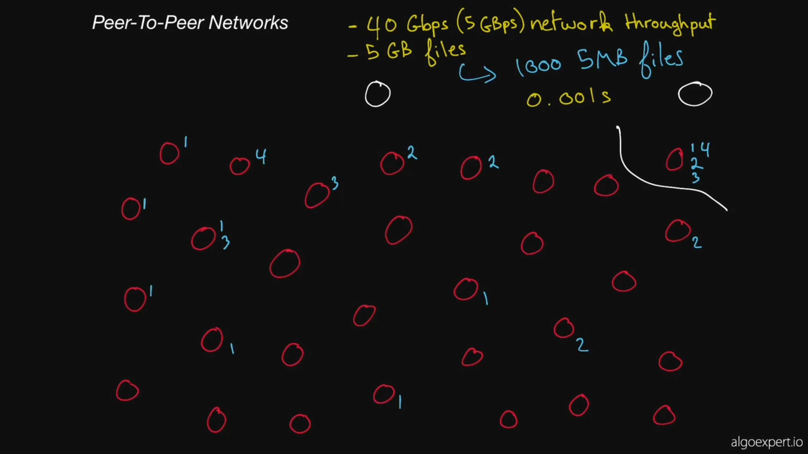

Peer to peer networks 

    taken from algoexpert

2 ways of doing this

1. Tracker - managing all the peers
(next peer to fetch information from). 
(next peer requiring the information). 

2. Gossip protocol

each peer has the information of the peers it has talked to previously in the form of hash tables -> Distributed Hash Table, so any peers that it communicates with later it shares the same information and so on. 

ex: Kraken.
