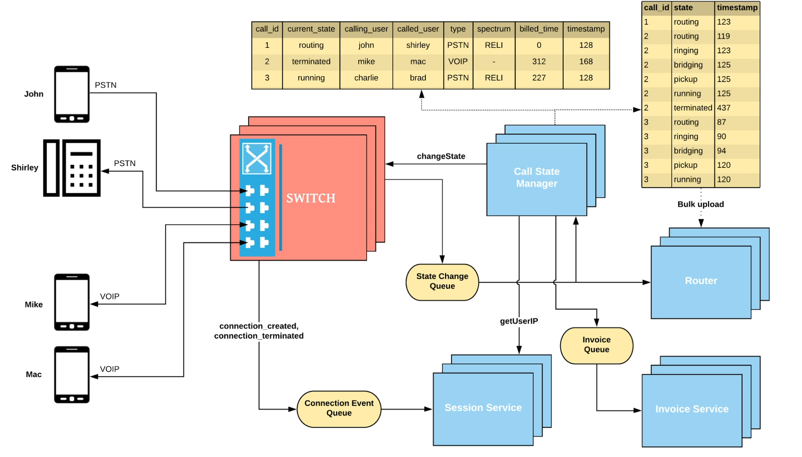

calling over the internet is  possible in 2 ways

refer notebook notes till

things to consider:

in a voip call - we just connect the two switches 
in a pstn call - we consider the following things:
    1.  call quality 
    2. network provider's fee. 

        different companies own different spectrums, hence the companies charge you accordingly.

        over a period of time we can figure out a means of where we can improvement our choice of getting the best call quality and reduced fee. 

        such decisions can be made by a recommendation engine, which can take up the logs from the call state manager, and also take the real time data from the message queue. 

        such architecture is called as the lambda architecture.

    